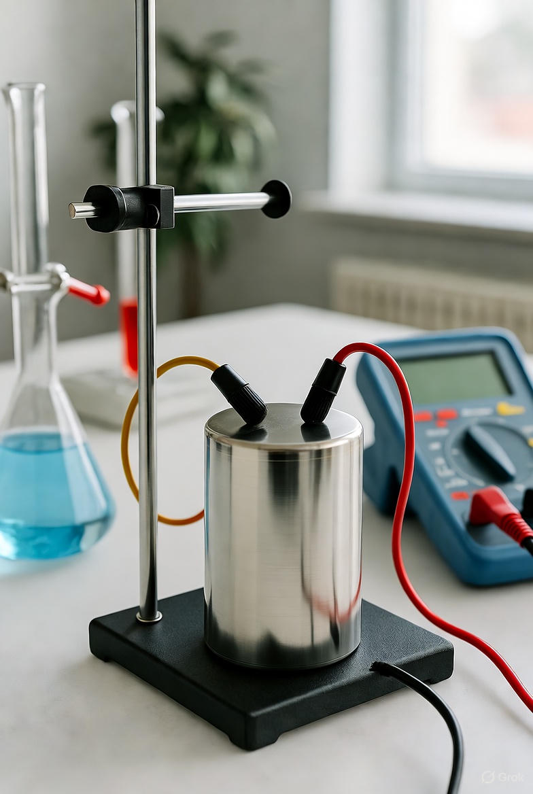
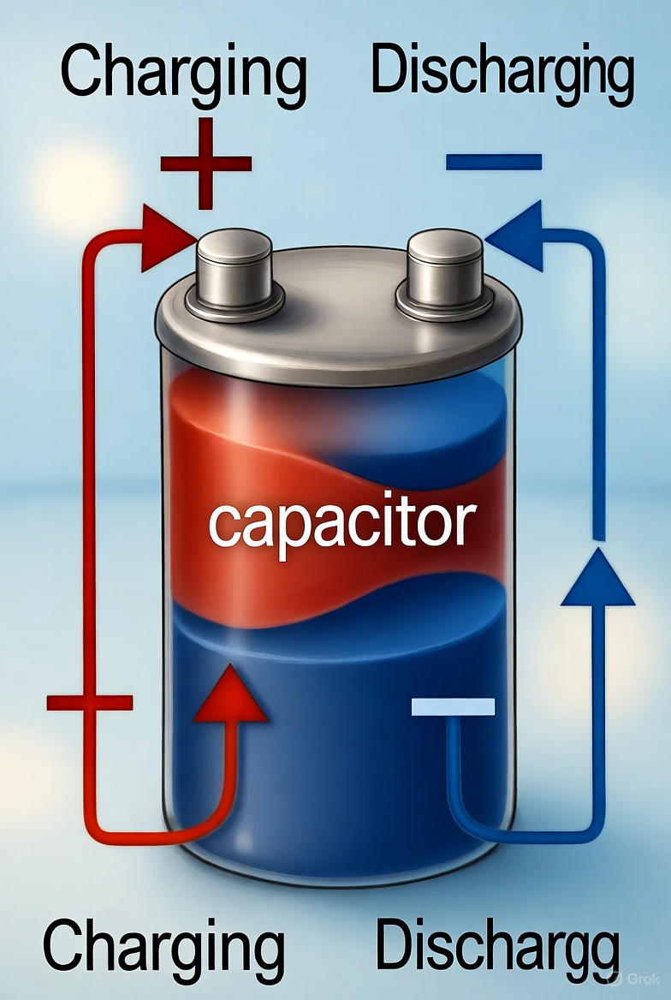
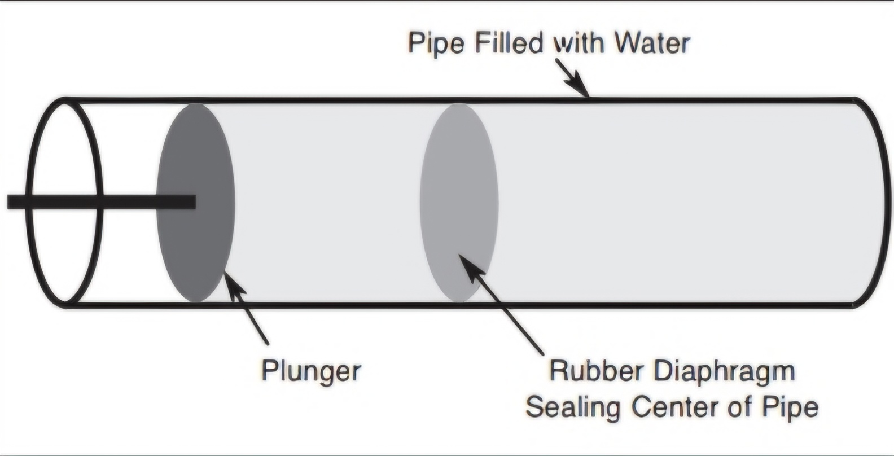
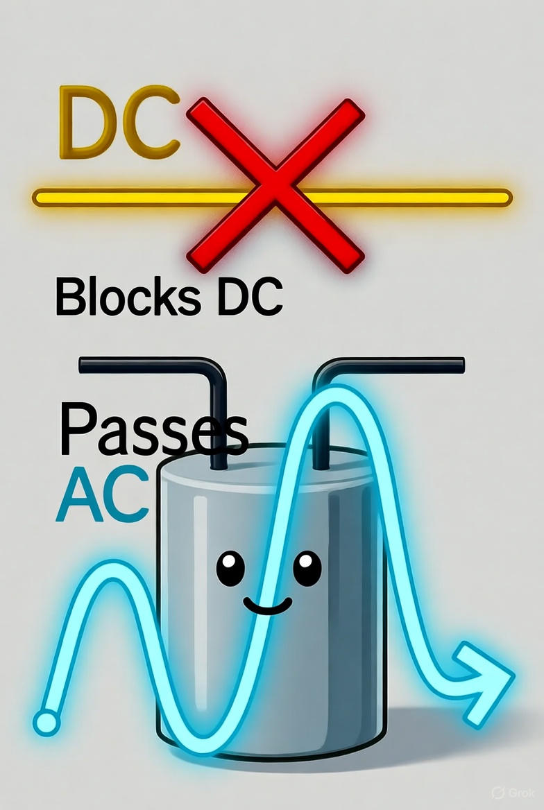
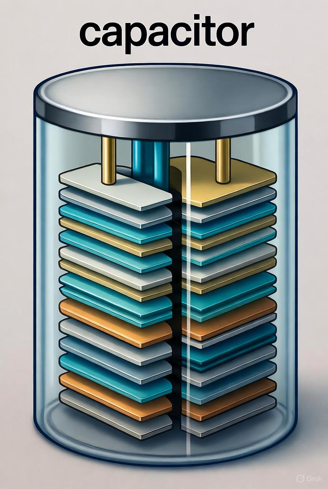
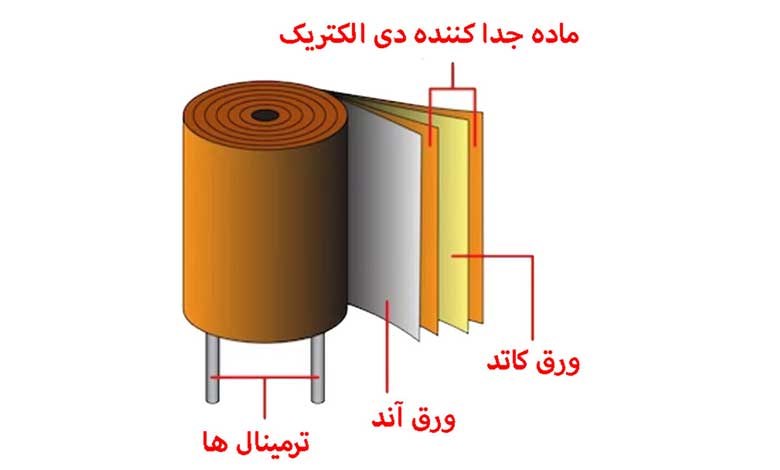
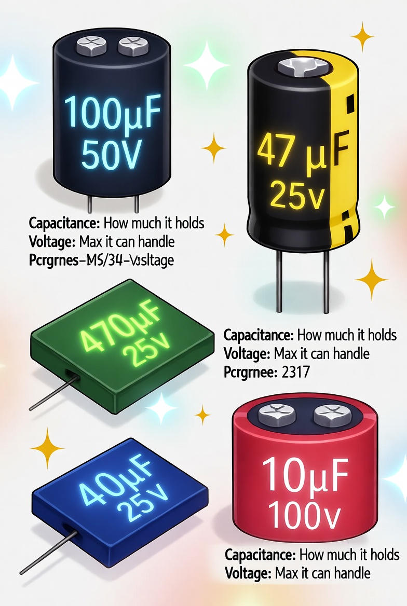
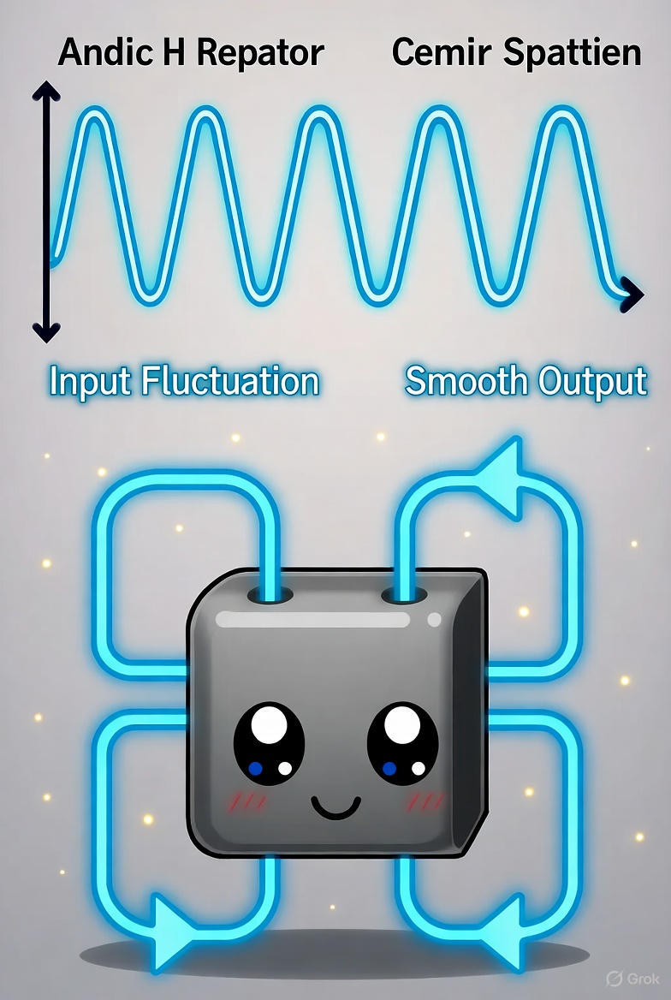
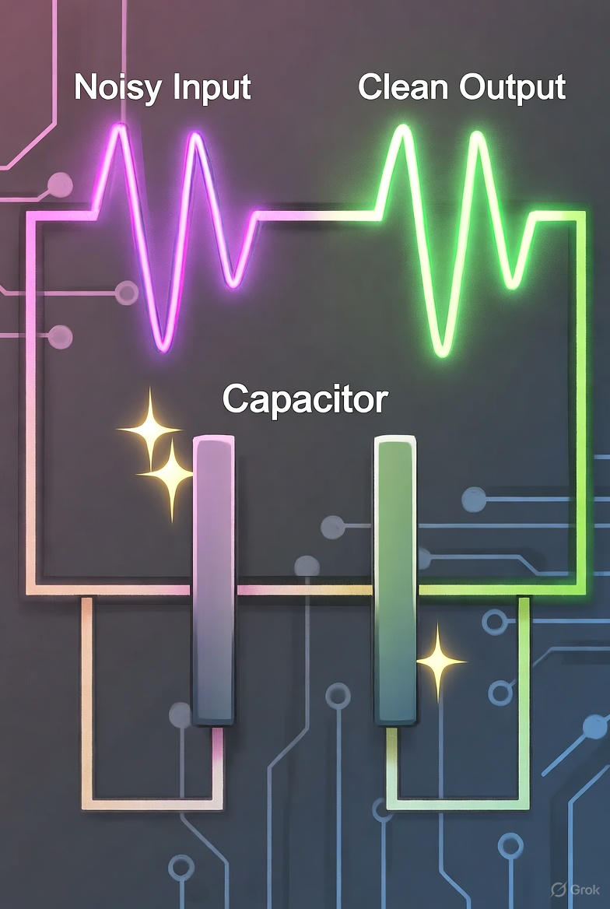

# خازن(Capacitor)
## فهرست مطالب

1. [خازن چیست؟](#capacitor)
2. [شارژ و تخلیه خازن](#charge-discharge)
3. [مثال ساده با آب](#water-example)
4. [رفتار خازن](#behavior)
5. [اجزای اصلی خازن](#components)
6. [نحوه ساخت خازن](#construction)
7. [ظرفیت و ولتاژ خازن](#capacitance-voltage)
8. [کاربردهای خازن](#applications)
9. [نتیجه‌گیری](#conclusion)

---

## 1. خازن چیست؟ 
 

خازن یکی از قطعات مهم و جالب در مدارهای الکتریکی است.  
کار اصلی آن **ذخیره و آزاد کردن انرژی الکتریکی برای مدت کوتاه** است.  

به زبان ساده، خازن مثل **یک ظرف کوچک برای نگه‌داشتن برق** است.  
وقتی به آن برق وصل می‌شود، پر از انرژی می‌شود (می‌گوییم شارژ شده است).  
وقتی مدار به انرژی نیاز دارد، خازن برق ذخیره‌شده را بیرون می‌دهد.

 1. تصویر خازن و جریان شارژ/تخلیه

---

## 2. شارژ و تخلیه خازن 

وقتی خازن را به باتری وصل می‌کنیم، مقداری از بارهای الکتریکی در یک طرف جمع می‌شوند و در طرف دیگر کمتر می‌شوند.  
در این حالت می‌گوییم خازن **شارژ شده** است.  

اگر مسیر جریان را باز کنیم، بارها دوباره برمی‌گردند و اختلاف بین دو طرف از بین می‌رود — یعنی **خازن تخلیه می‌شود**.

 2. فرایند شارژ و تخلیه خازن

---

## 3. مثال ساده با آب 

تصور کنید لوله‌ای دارید که وسط آن **تیغه‌ای نرم و انعطاف‌پذیر** قرار گرفته است.  
وقتی آب از یک طرف فشار می‌آورد، تیغه کشیده می‌شود و انرژی را در خودش نگه می‌دارد.  
وقتی فشار کم می‌شود، تیغه آب را به سمت دیگر برمی‌گرداند.  

خازن هم همین کار را با برق انجام می‌دهد:  
وقتی ولتاژ زیاد می‌شود، خازن انرژی را ذخیره می‌کند، و وقتی ولتاژ پایین می‌آید، انرژی را برمی‌گرداند.  

 3. مثال تیغه‌ی لاستیکی در لوله برای درک عملکرد خازن

---

## 4. رفتار خازن 

خازن‌ها در مدارها همیشه یک رفتار جالب دارند که بسته به نوع برق فرق می‌کند.  
در این بخش می‌خواهیم ببینیم وقتی برق مستقیم یا برق متناوب به خازن می‌دهیم، چه اتفاقی می‌افتد و چرا خازن در مدارها اینقدر مهم است.

### 4.1 برق مستقیم (DC) 
در این نوع برق، جریان همیشه در یک جهت حرکت می‌کند.  
خازن فقط در لحظه‌های اول که در حال شارژ است جریان را عبور می‌دهد.  
بعد از شارژ کامل، دیگر اجازه عبور نمی‌دهد.  
پس در برق مستقیم، خازن مثل **سد** عمل می‌کند.

### 4.2 برق متناوب (AC) 
در این نوع برق، جهت جریان مدام عوض می‌شود.  
به همین دلیل، خازن دائم در حال شارژ و تخلیه است و جریان می‌تواند از آن عبور کند.  
یعنی در برق متناوب، خازن مانند **دروازه‌ای نیمه‌باز** رفتار می‌کند.

 4. نمودار رفتار خازن در جریان AC و DC

---

## 5. اجزای اصلی خازن 

خازن از **سه بخش اصلی** تشکیل شده است:  

1. دو صفحه فلزی که بار الکتریکی را در خود نگه می‌دارند.  
2. یک لایهٔ نازک عایق (دی‌الکتریک) بین آن‌ها که اجازه عبور جریان نمی‌دهد.  
3. روکش خارجی که از آن محافظت می‌کند.  

 5. ساختار داخلی خازن

---

## 6. نحوه ساخت خازن 

در بسیاری از خازن‌ها، دو ورق فلزی به‌همراه لایه‌ای از عایق به صورت **رول‌شده داخل یک استوانه** قرار می‌گیرند.  

اگر مادهٔ عایق نرم باشد → خازن می‌تواند برق بیشتری نگه دارد، اما ولتاژ زیادی را تحمل نمی‌کند.  
اگر مادهٔ عایق سخت باشد → ولتاژ بالا را تحمل می‌کند، ولی انرژی کمتری ذخیره می‌کند.  

 6. رول فلزی با دی‌الکتریک

---

## 7. ظرفیت و ولتاژ خازن 

**ظرفیت (Capacitance):**  
نشان می‌دهد خازن چقدر می‌تواند برق در خود نگه دارد.  
واحد آن «فاراد» (F) است، اما معمولاً از «میکروفاراد (µF)» یا «نانوفاراد (nF)» استفاده می‌شود.  

**ولتاژ کاری:**  
بیشترین مقدار ولتاژی است که خازن می‌تواند بدون آسیب‌دیدن تحمل کند.  

 7. ظرفیت و ولتاژ روی بدنه خازن

---

## 8. کاربردهای خازن 

خازن‌ها در مدارهای الکتریکی نقش‌های مختلف و مهمی دارند.  
در ادامه، به سه کاربرد اصلی آن‌ها می‌پردازیم:

### 8.1 صاف کردن برق 
وقتی برق از منبع وارد مدار می‌شود، ممکن است جریان یا ولتاژ کمی بالا و پایین برود.  
خازن مانند یک «بالشتک» عمل می‌کند:  

- وقتی برق زیاد شد، خازن آن را نگه می‌دارد.  
- وقتی برق کم شد، خازن انرژی ذخیره‌شده را آزاد می‌کند.  

 8. خازن به عنوان بالشتک برای یکنواخت کردن برق

### 8.2 کاهش نویز 
گاهی در مدار، برق همراه با لرزش یا نویزهای کوچک است که می‌تواند کارکرد قطعات را خراب کند.  
خازن می‌تواند این اختلال‌ها را کاهش دهد.

 9. خازن مانند صافی برای کاهش نویز

### 8.3 عبور تغییرات برق 
گاهی می‌خواهیم فقط **تغییرات سریعِ برق** (مثل صدا یا اطلاعات) از یک نقطه عبور کند و **برق ثابت** وارد آن نشود.  
خازن برق ثابت را مسدود می‌کند ولی تغییرات سریع را عبور می‌دهد.

---

## 9. نتیجه‌گیری 

خازن یک قطعه کوچک اما بسیار کاربردی در مدارهای الکتریکی است.  
این قطعه می‌تواند **انرژی را ذخیره و آزاد کند، جریان برق را صاف و پایدار نگه دارد، نویزها را کاهش دهد و فقط تغییرات مورد نیاز برق را عبور دهد**.  

با درک عملکرد خازن، می‌توانیم مدارهای ایمن‌تر و کارآمدتری بسازیم و از دستگاه‌های الکترونیکی بهتر استفاده کنیم.

--- 

## منابع

1. [Electronics Tutorials – What is a Capacitor?](https://www.electronics-tutorials.ws/capacitor/cap_1.html)
2. [All About Circuits – Capacitors](https://www.allaboutcircuits.com/textbook/direct-current/chpt-13/capacitors/)
3. Seymour, A. F. *Basic Electronic Components – Instruction Manual.*  
