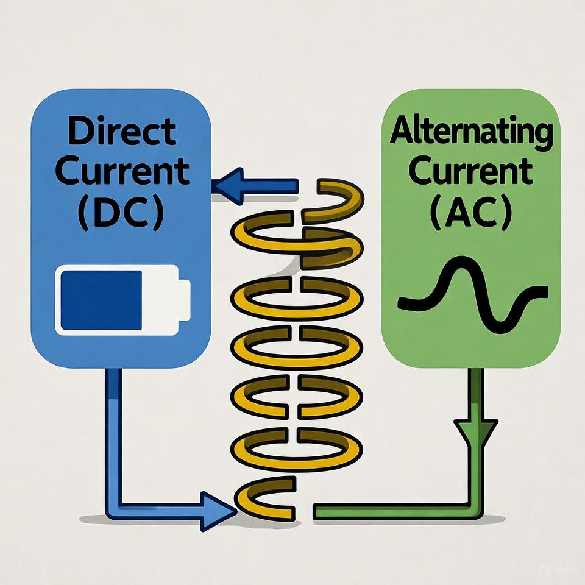
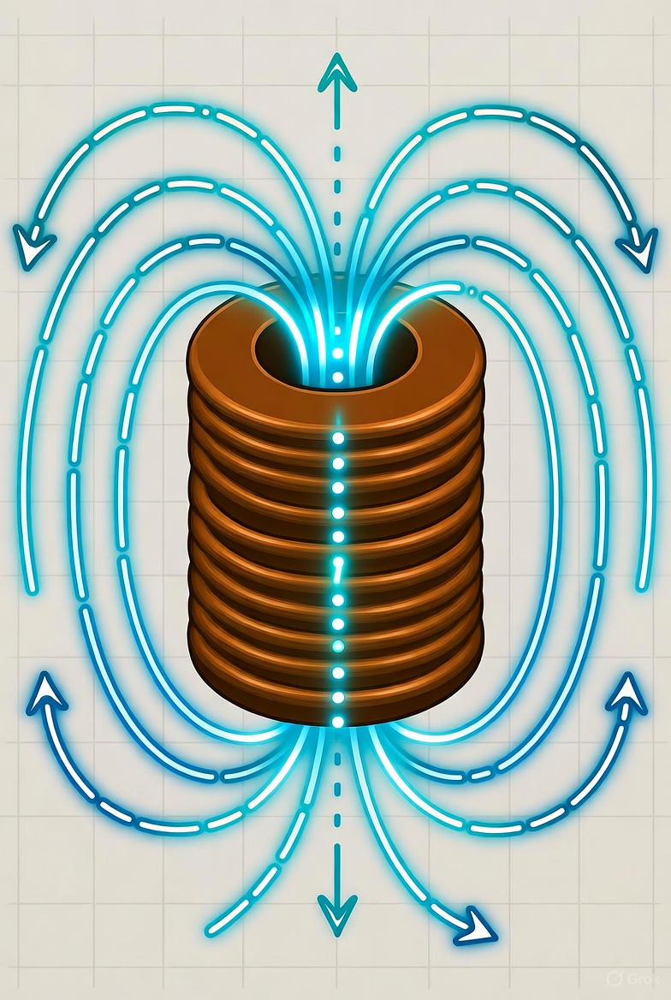
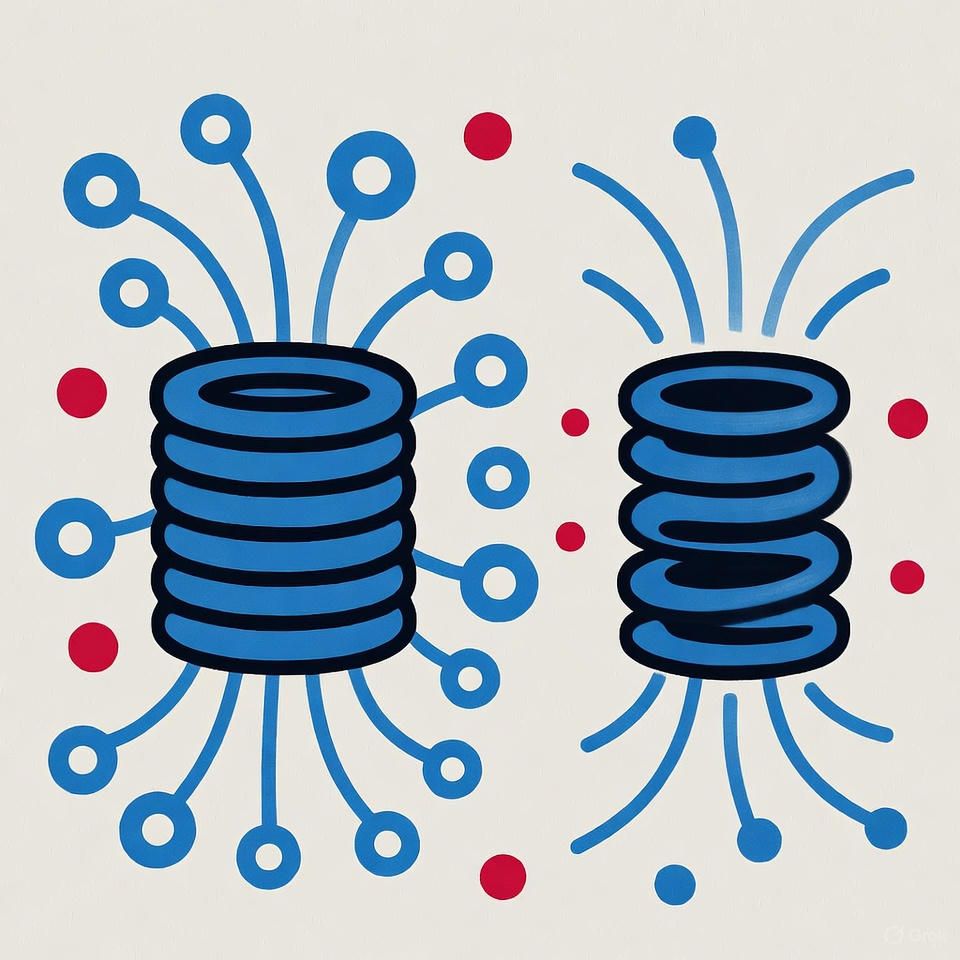
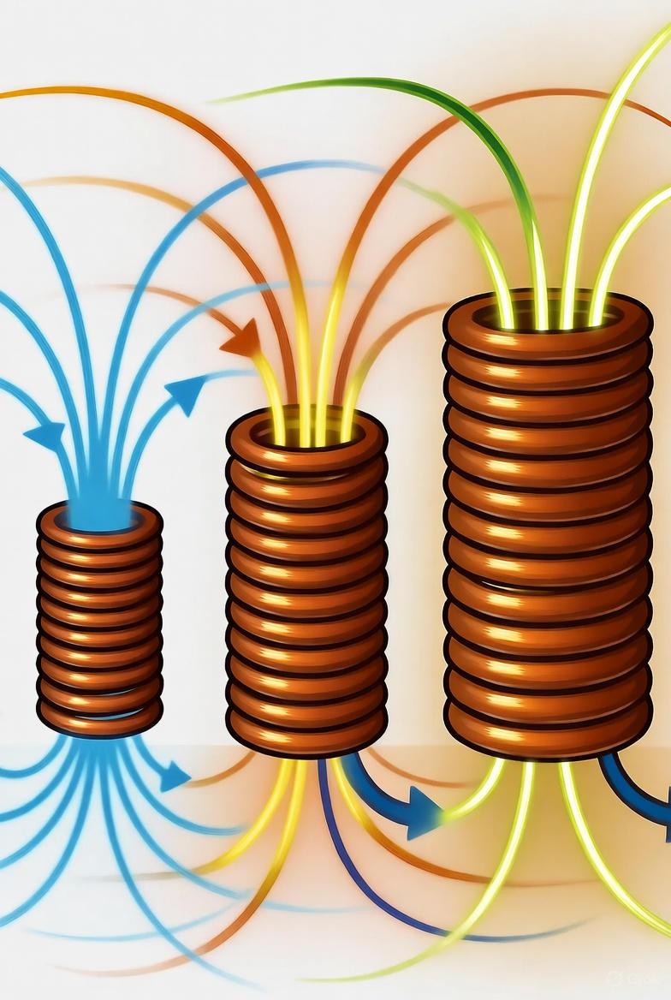
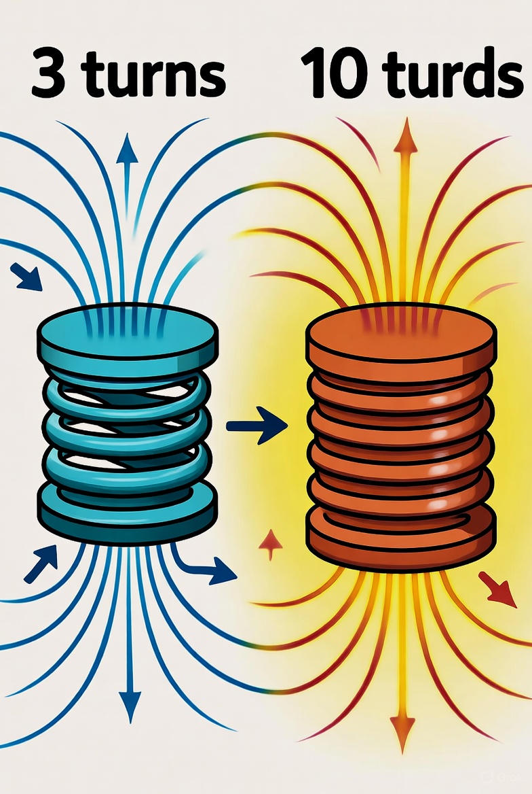
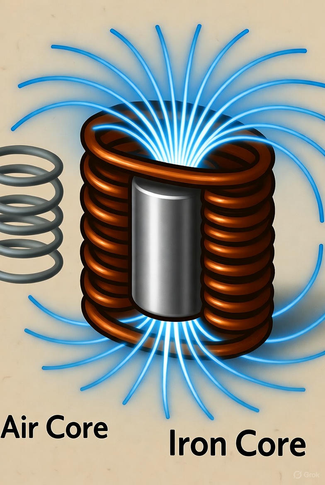
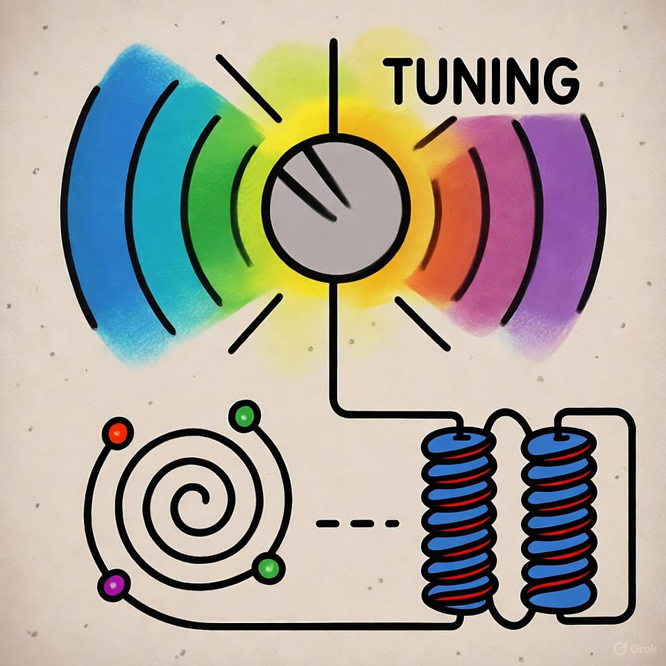
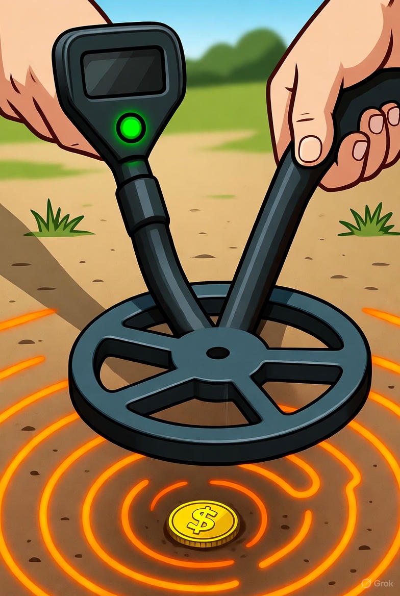

# سلف (Inductor)

## اطلاعات نویسنده  

**نام:** زینب بادیانی
**ایمیل:** raintdiana@gmail.com 

---

## فهرست مطالب
1. [سلف چیست؟](#inductor)
2. [سلف و جریان برق](#inductor-and-electric-current)
3. [رفتار جادویی سیم‌پیچ](#magical-behavior-of-coil)
4. [چه چیزهایی روی قدرت سلف تأثیر دارند؟](#factors-affecting-inductance)
5. [کاربردهای سلف](#applications-of-inductor)
6. [نتیجه گیری](#conclusion)
## 1. سلف چیست؟

سلف یکی از قطعات جالب در مدارهای الکتریکی است.  
کار اصلی آن مقاومت در برابر تغییر ناگهانی جریان برق است.  
برای درک بهتر، تصور کن یک **شلنگ آب بلند** داری که چند دور دور خودش پیچیده شده است.  
وقتی آب را باز می‌کنید، آب بلافاصله بیرون نمی‌آید، چون باید تمام شلنگ پر شود.  
اما وقتی آب در جریان می‌افتد و ناگهان شیر را می‌بندی، هنوز کمی آب از شلنگ بیرون می‌ریزد!

سلف هم دقیقاً همین‌طور رفتار می‌کند:  
وقتی جریان برق ناگهان زیاد یا کم شود، سلف نمی‌گذارد به سرعت تغییر کند.  
انگار جریان را **آرام و کنترل‌شده** می‌کند.

 1. تصویری از شلنگ پیچیده‌شده

---

## 2. سلف و جریان برق

سلف معمولاً از **سیمی که چندین بار به دور خودش پیچیده شده** ساخته می‌شود.  
به همین دلیل به آن **سیم‌پیچ (Coil)** هم می‌گویند.  

ویژگی جالب سلف این است که:
- جریان **مستقیم (DC)** را به راحتی عبور می‌دهد.  
- اما جلوی جریان **متناوب (AC)** را تا حدی می‌گیرد.

این ویژگی دقیقاً **برعکس خازن** است!  
خازن جلوی جریان مستقیم را می‌گیرد ولی جریان متناوب را عبور می‌دهد.  
به همین خاطر، سلف و خازن دو قطعه‌ی **مکمل** در مدار هستند.

 2.عبور جریان DC و مقاومت در برابر جریان AC توسط سلف

---

## 3.رفتار جادویی سیم‌پیچ

وقتی جریان برق از یک سیم عبور می‌کند، اطراف آن مقداری نیرو به‌وجود می‌آید که به آن **میدان مغناطیسی** 
می‌گویند.
این میدان مغناطیسی همان چیزی است که در آهن‌ربا هم وجود دارد.
حالا تصور کن این سیم را چند بار دور خودش بپیچی، مثل فنر.
در این حالت، میدان‌های مغناطیسیِ کوچکی که اطراف هر حلقه به‌وجود می‌آید، روی هم جمع می‌شوند و یک میدان قوی‌تر درست می‌کنند.
به همین دلیل سلف‌ها را به شکل سیم‌پیچ می‌سازند.

این میدان مغناطیسی مثل یک **باتری موقت** عمل می‌کند؛ یعنی می‌تواند برای مدت کوتاهی انرژی را در خودش نگه دارد.
وقتی جریان قطع می‌شود، سلف این انرژی مغناطیسی را دوباره به مدار برمی‌گرداند — مثل فنری که وقتی فشارش می‌دهی، انرژی ذخیره می‌کند و بعد رها می‌شود.

 3.سیم‌پیچ با خطوط میدان مغناطیسی اطراف آن

---

## 4. چه چیزهایی روی قدرت سلف تأثیر دارند؟

سلف مثل **فنر جادویی مغناطیسی** است، اما قدرتش به چند عامل بستگی دارد : 

### 4.1 فاصله بین پیچ‌ها

اگر حلقه‌های سیم‌پیچ به هم نزدیک‌تر باشند، میدان‌های مغناطیسی با هم ترکیب می‌شوند و قوی‌تر می‌شوند.  
اما اگر فاصله زیاد باشد، میدان‌ها از هم جدا می‌مانند و سلف ضعیف‌تر می‌شود.

 4.مقایسه دو سیم‌پیچ 

---

### 4.2 قطر سیم‌پیچ

هرچه سیم‌پیچ بزرگ‌تر باشد، میدان مغناطیسی اطرافش گسترده‌تر می‌شود و انرژی بیشتری ذخیره می‌کند.  
پس هرچه قطر سیم‌پیچ بیشتر باشد، **سلف قوی‌تر** است.

 5.سیم‌پیچ با قطرهای مختلف

---

### 4.3 تعداد دورهای سیم‌پیچ

هرچه **تعداد حلقه‌ها بیشتر** باشد، میدان‌های بیشتری روی هم جمع می‌شوند و قدرت سلف افزایش پیدا می‌کند.  
در واقع با اضافه کردن دورهای بیشتر، سلف مثل فنری قوی‌تر می‌شود.

 6.سیم‌پیچ با تعداد دور مختلف

---

### 4.4 جنس هسته (مغز سلف)

اگر در وسط سیم‌پیچ از **هسته‌ی آهنی یا مغناطیسی** استفاده شود، میدان قوی‌تر می‌شود و سلف انرژی بیشتری ذخیره می‌کند.  
اما اگر وسطش خالی یا غیرمغناطیسی باشد، میدان ضعیف‌تر خواهد بود.

 7. سیم پیچ با هسته آهنی 

---

## 5. کاربردهای سلف

### 5.1 تنظیم و انتخاب فرکانس 

در رادیوها و تلویزیون‌ها، سلف کمک می‌کند فقط «ایستگاه دلخواه» را دریافت کنیم.  
با تغییر مقدار سلف و خازن، مدار طوری تنظیم می‌شود که فقط همان فرکانس تقویت شود.

**مثال:**  
مثل وقتی بین ایستگاه‌های مختلف رادیو، فقط یکی را انتخاب می‌کنی تا صدایش واضح پخش شود.

 8. تنظیم فرکانس

---

### 5.2 تشخیص اجسام فلزی 

در دستگاه‌های فلزیاب یا گیت‌های فروشگاه، سلف میدان مغناطیسی ایجاد می‌کند.  
وقتی فلز به آن نزدیک شود، میدان تغییر می‌کند و مدار متوجه حضور فلز می‌شود — بدون تماس!

**مثال:**  
مثل زمانی که از گیت فروشگاه رد می‌شوی و دستگاه وجود تگ فلزی را تشخیص می‌دهد.

 9. فلزیاب

---

### 5.3 صاف‌کردن جریان برق 

وقتی جریان برق ناگهان زیاد یا کم می‌شود، سلف مثل یک «ذخیره‌کننده مغناطیسی» عمل می‌کند.  
اگر جریان زیاد شود، انرژی را در خود نگه می‌دارد و اگر کم شود، آن را پس می‌دهد تا جریان ثابت‌تر شود.

 **مثال:**  
مثل زمانی که موج دریا بالا و پایین می‌رود، سلف مثل یک سد کوچک جلوی موج‌ها را می‌گیرد تا حرکت آرام‌تر شود.

---
## 6. نتیجه‌گیری

سلف یکی از قطعات بسیار مهم در دنیای برق و الکترونیک است.  
رفتارش شبیه فنری است که در برابر تغییر ناگهانی جریان مقاومت می‌کند و انرژی را در قالب میدان مغناطیسی ذخیره می‌نماید.  
این ویژگی باعث می‌شود سلف در مدارهای مختلف — از رادیو و تلویزیون گرفته تا شارژر موبایل و فیلتر برق — نقشی کلیدی داشته باشد.  

اگر خازن را عضوی بدانیم که با ولتاژ سروکار دارد،  
سلف همان قطعه‌ای است که **رفتار جریان برق را کنترل می‌کند**.  
به همین دلیل در بسیاری از مدارها، خازن و سلف در کنار هم قرار می‌گیرند تا جریان و ولتاژ را به تعادل برسانند.  

درک کارکرد سلف، یعنی فهم یکی از رازهای جذاب و دیدنی دنیای الکتریسیته 

---
## منابع

1. https://www.geeksforgeeks.org/physics/real-life-applications-of-inductor/
2. Seymour, A. F. *Basic Electronic Components – Instruction Manual.*  
---
